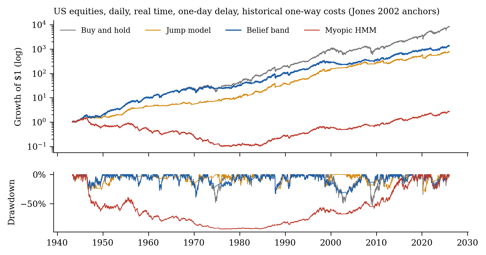
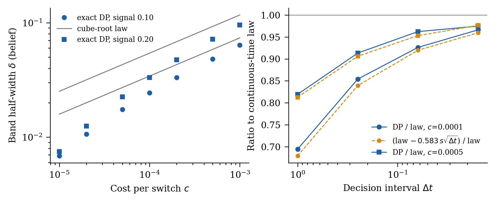

# Planning through regimes

**A century of real-time evidence on regime-switching allocation, a faithful test of the state of the art outside its sample, and a cube-root law for trading on uncertain beliefs.**

[Paper (PDF)](paper/belief_band.pdf) · [Interactive explorer](https://takakhoo.com/regimes) · prepared for ACM ICAIF 2027



Regime models promise to hold less risk when markets turn turbulent. This repository tests them the way an allocator would have lived them: every parameter, hyperparameter, standardisation and state estimate dated by what was knowable, US data back to 1926, and one-way trading costs anchored to a century of measured equity costs (Jones 2002). Then it shows why regime signals fail in execution, and how planning fixes that.

## What the experiments show

| Finding | Number |
|---|---|
| Same two-state HMM, as its information set shrinks: smoothed probabilities → full-sample parameters, filtered → real time | Sharpe **0.86 → 0.55 → 0.46** (60/40: 0.57) |
| 35 real-time HMM configurations (5 feature sets, 2/3/BIC states, 3 execution rules), 1947-2025 | **0 of 35** beat 60/40; best ties it (Δ = −0.002, p = 0.98) |
| State-of-the-art statistical jump model (Shu, Yu & Mulvey 2024), faithful re-implementation, on its own 1990-2023 window | Sharpe 0.51 vs 0.49, drawdown **−30% vs −55%** |
| Same protocol on 1950-1989, which it never saw | **0.35 vs 0.59** for buy-and-hold |
| Daily HMM executed myopically vs through the cost-aware belief band, 1942-2025, historical costs | myopic **−0.11** (drawdown −94%); band **0.48** (drawdown −36%) |
| Band vs myopic at 25 bp / 50 bp / historical costs | +0.25 / +0.49 / +0.59 Sharpe, all **p < 0.001** |
| Band vs jump model; band vs buy-and-hold | statistically tied; same Sharpe band, about half the drawdown |
| Four non-US developed markets, 2009-2026 | every regime strategy trails buy-and-hold by 0.2-0.4 Sharpe |

In real time, regime timing does not beat a static allocation on risk-adjusted return. What separates a regime rule that survives costs from one that destroys capital is whether it plans for the cost of acting on its own uncertainty.

## The theory

Without trading costs, the regime POMDP is solved exactly by the myopic rule: nothing you do changes what you learn, so belief-space planning and QMDP add nothing (Proposition 1). Put the current holding in the state and charge each switch a cost K, and the optimal policy becomes a hysteresis band in belief space (Proposition 2):

```
delta = (3 K s^2 / 2 g)^(1/3)            s: belief diffusion at the indifference point
delta_dt ~ delta - 0.5826 * s * sqrt(dt)  g: slope of the utility gain; 0.5826 = -zeta(1/2)/sqrt(2*pi)
```

Exact dynamic programming confirms the law and its discrete-monitoring correction to within 2% ([experiments/03b](experiments/03b_theory_refinement.py)), and on 186 refits of the real daily model the corrected law predicts the bands the solver chose (median ratio 0.97, correlation 0.93 when costs vary).



## What it means for an allocator

The band is set by the cost of the instrument used to act. Solving the exact belief MDP for the daily equity regime signal at each asset class's one-way cost:

| Instrument | One-way cost | Hold equity while P(turbulent) is in | Switches / yr |
|---|---:|---|---:|
| E-mini S&P 500 futures | 0.2 bp | about 0.50 (myopic) | 10.8 |
| 10-year Treasury | 0.9 bp | 0.46 to 0.57 | 9.5 |
| Large-cap equity, institutional | 8.9 bp | 0.32 to 0.76 | 5.9 |
| Investment-grade corporates | 38 bp | 0.17 to 0.89 | 4.1 |
| US equity, 1953-1975 | 100 bp | 0.08 to 0.96 | 3.0 |
| Buyout fund stake, secondary, 2025 | 8% | never sells | 0 |
| Any PE stake, secondary, 2009 | 46% | never sells | 0 |

At private-equity secondary discounts the optimal policy never sells, whatever the belief. That is the denominator effect explained: tolerating an overweight, or raising the target, is the band at work. Sources for every cost are in [notes/asset_class_costs.md](notes/asset_class_costs.md).

## Reproduce

Python 3.13, CPU. Set `OMP_NUM_THREADS=1` (scikit-learn's k-means otherwise oversubscribes threads inside the parallel workers).

```sh
python3 -m venv .venv && source .venv/bin/activate
pip install -r requirements.txt
python scripts/fetch_data.py            # downloads inputs, checks SHA-256 against the paper's versions
python -m pytest -q tests                # Proposition 1, hysteresis, causality of filters, accounting
export OMP_NUM_THREADS=1
python experiments/02_sjm_daily.py       # jump-model replication and out-of-era test   (~5 min)
python experiments/03_theory_bandwidth.py && python experiments/03b_theory_refinement.py
python experiments/04_hmm_daily_band.py  # daily HMM, myopic vs band, 4 costs            (~40 min)
python experiments/05_main_grid.py       # monthly real-time grid, 50 strategies          (~30 min)
python experiments/06_costs_matched.py   # jump model at matched costs, historical costs
python experiments/07_international.py   # four developed markets
python experiments/08_daily_analysis.py  # tables, bootstrap tests, spanning regressions
python experiments/09_robustness.py && python experiments/11_monthly_analysis.py
python experiments/12_allocator_bands.py && python experiments/10_figures.py
```

Every number in the paper is written to `results/` by these scripts. The daily runs are deterministic given the seeds; numerical results can differ slightly across BLAS builds.

## Repository map

| Path | What it does |
|---|---|
| `src/regimes/data.py` | Monthly panel 1926-2025, each column dated by when it was knowable |
| `src/regimes/models/hmm.py`, `models/jump.py` | Gaussian HMMs (filtered and smoothed) and statistical jump models (numba DP, online labels) |
| `src/regimes/pomdp.py` | Exact belief-space DP: Gauss-Hermite / QMC belief kernel, relative value iteration, no-trade bands |
| `src/regimes/sjm_daily.py` | The published jump-model protocol, daily, any market |
| `src/regimes/hmm_daily.py` | Daily HMM with myopic and belief-band execution, per-refit theory diagnostics |
| `src/regimes/engine.py`, `backtest.py` | Walk-forward engine, baselines, drift-aware per-asset costs, Jones-anchored cost schedule |
| `src/regimes/stats.py` | Stationary bootstrap, Newey-West spanning regressions, deflated Sharpe |
| `paper/icaif/` | ACM `acmart` sigconf source of the paper |
| `notes/` | Verified literature map and bibliography, venue notes, sourced asset-class costs |

## Data

French Data Library (CRSP value-weighted market and T-bills, daily from 1926; Bloomberg-based international markets from 1990), the updated Welch-Goyal predictor file (bond returns, yields, spreads to 2025) and FRED (NBER dates, VIX). Raw files are not committed; `scripts/fetch_data.py` downloads them and checks their hashes. Nothing here is investment advice.

## Origins

This study grew out of a course project in ENGS 177 (Decision Making Under Uncertainty, Dartmouth, Spring 2026) with Dario Blanco Morales, Even Hogberget and Kyle David Ledda-Lewaren ([takakhoo/pomdp-regime-allocation](https://github.com/takakhoo/pomdp-regime-allocation)). That project's corrected result, that its QMDP planner reduces to a myopic rule and does not beat 60/40, is the starting point here. This repository is a new and independent study: new data back to 1926, new models, a new theory and new experiments.
